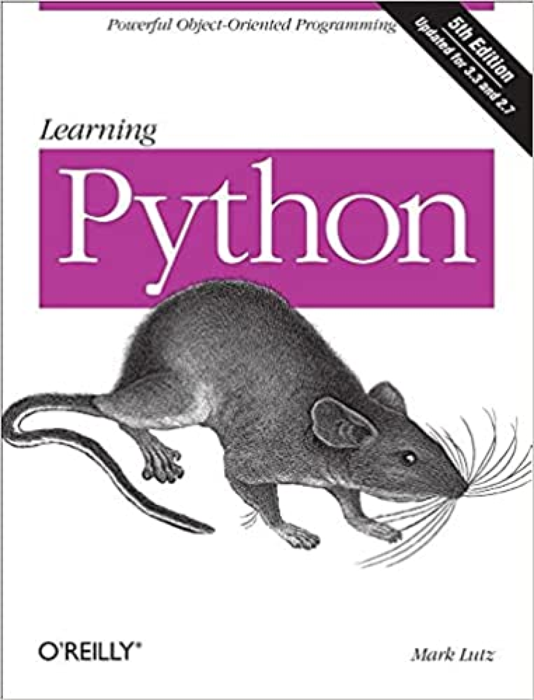
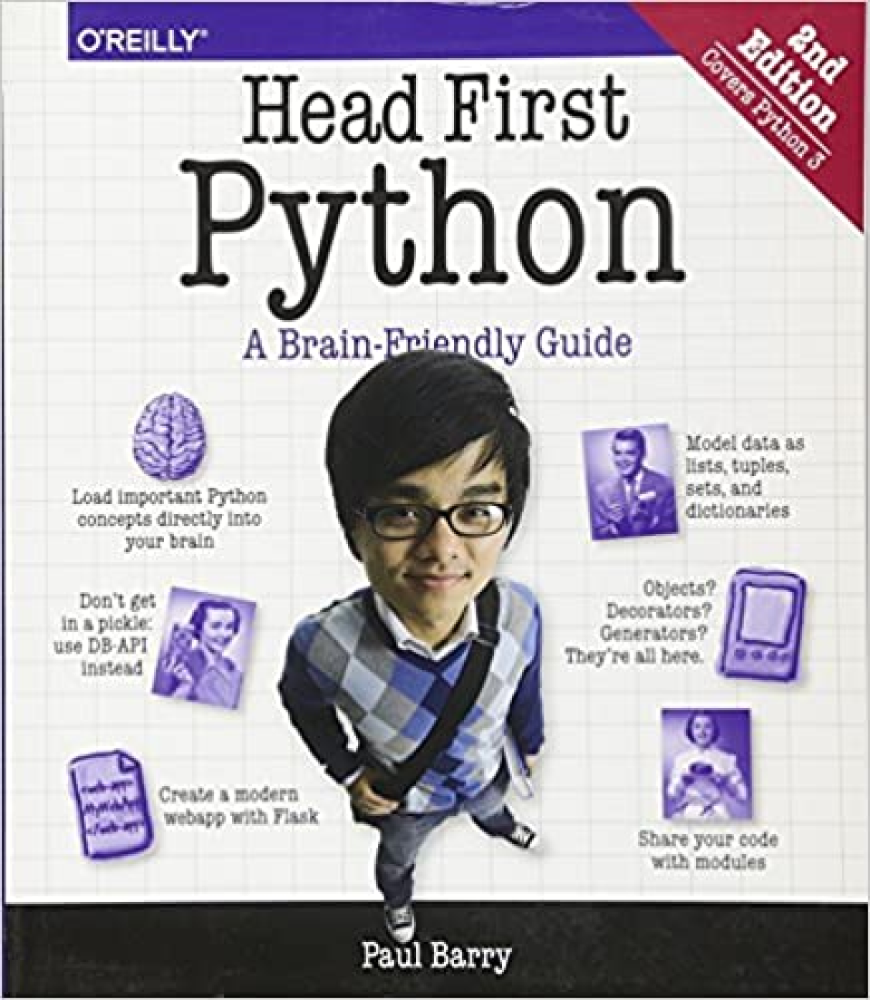
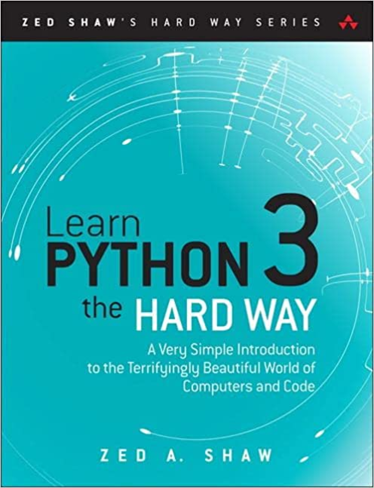

# Greetings and salutations!

## The plan this week:

We have four Jupyter notebooks in the tutorials this week. They will give you:

- a tour of Jupyter notebooks.
- a tour of Python programming language.
- an overview of Python packages.
- An example of working with some LIGO data in Jupyter.

By necessity, we will keep things short and simple, and gloss over
some things.

# Jupyter notebooks

## What are Jupyter notebooks?  Why are they useful?

- Jupyter notebooks are a way to write text/documentation, code,
  equations, data, graphs, images, etc. together.
- You can view and edit these notebooks in a browser window.
- You can execute code in these notebooks from the browser window.
- You can share these notebooks with other people.

They are kind of like paper lab notebooks, but in a browser window.

## Jupyter notebooks

TODO: add a screenshot here.

## JupyterLab

TODO: add a screenshot here.

## JupyterLab instances out there

- Google Colab
- GitHub's thing
- MS Planetary Computer
- FABRIC's JupyterLab instance
- Chameleon project's JupyterLab instance


# Python

## First, a Word about Python

We will not attempt to teach you Python this week. But!

If you know any other programming language, you can learn Python on
your own very quickly.  Find a resource that suits your learning
style.

:::: {.columns}

::: {.column width="20%"}


:::

::: {.column width="20%"}



:::

::: {.column width="20%"}



:::

::: {.column width="20%"}



:::

::::

## Variables

Variables are like you expect, except they have no types.  A variable
can be a number one moment and suddenly become a string in the next
line:

```python
amount = 7
amount = “A whole lot!”
print(amount)
```

prints out: `A whole lot!`

## Statements


## Flow of control

You have `if`, `if`/`else`, `for`, `while`, etc.

## Example

Here's a for loop inside of an if statement:

```python
if temperature >= 100:
    print("It boiled!")
    for sample_tube in range(1, 6):
        print("concentration is: ", tube_concentration[sample_tube])
else:
    print("Warmed up, but not boiling yet. Try harder.")
```
  
Notice colons at the ends of the `if`, `for`, and `else` statements.  

## Code layout has meaning

- Code blocks are indicated by indentation level
  - In comparison C, C++ and Java begin blocks with `{` and end them
    with `}`.
- Indentation of a code block MUST be the same for the entire block. 
- Best Practice: indent with four spaces.
- Do not use tab characters unless you're certain that your editor
  will turn `<tab>` keys into spaces.


## Basic data types

- Booleans (True and False)
- Numbers
  - Integers (example: -1, 0, 1, 2, …)
  - Floating point numbers (example: 3.14)
- Strings (example: “hello world!”)

## Built-in data structures

- Lists
- Dictionaries
- Tuples
- Sets

## Lists

Python lists are like arrays in other languages, except:

- they can grow (and shrink) as needed
- the different elements of an array don't all have to be the same type

Lists are fundamentally one-dimensional. If you would normally use a
2D array for something, use a list of lists instead.

## List example

```python
temperatures = [ 44.2, 43.6, 107.9, "awfully hot"]
print (temperatures[3])
```

## Another list example

```python
grades = ["A", "B", "C", "D", "F"]
print (len(grades))     # prints 5
print(grades[0])        # prints A
print(grades[4])        # prints F
print(grades[5])        # this will raise an error!
```

Notice the first element in a list is numbered 0!

## Indexing

Any time you index into a list, Python always counts starting at 0,
not 1.

Forgetting this will likely be a big source of mistakes.


## Strings

Strings can be surrounded by single quotes (`'`) or double quotes
(`"`). Whichever one you start a string with, you have to end with
that same kind.

```python
>>> 'hello' == "hello"
True
>>> 'hello"
  File "<stdin>", line 1
    'hello"
    ^
SyntaxError: unterminated string literal (detected at line 1)
```

## More on strings

Python strings _act_ just like lists of letters.

Useful syntax for selecting just part of a string:

```python
st = "ABCDEFG"
print(st[2:4])    # prints CD
print(st[4:])     # prints EFG
print(st[:2])     # prints AB
```

Note that this will also work on lists.


## Dictionaries

```python
drugs = { 
   "asprin": 325, 
   "acetaminophen": 500 
}
print (drugs["asprin"])  # prints 325
```

## Operators

All the usual ones:  +, -, *, /
Integer division:   7 // 2   yields 3
Remainder:    7 % 2   yields 1
Exponentiation: 2 ** 8  yields 256

Operators can be overloaded (have different meanings depending on the
data type). The plus sign will concatenate strings: "Hi there, " +
'human' yields the single string "Hi there, human"

## Functions

Lots of built-in functions (print(), range(), etc.)
Easy to create your own:

```python
def simpleAlgebra(x, y):
  result = (x ** 2) + y
  return result
```

## Calling a function

```python
computed_result = simpleAlgebra(4, 3)
print(computed_result)
```

prints "19".

## User defined classes

TODO


## Error Handling with exceptions

When an unrecoverable error occurs, the Python runtime "throws" an
exception that is "caught" by an exception handler.

```python
try:
  individual_portion = total_grams / number_of_people
except:
  print("Number of people was zero, no valid answer!")
```

## Where Python Really Shines

Time to come clean with you: Python isn't all that great a
language. It's not bad, per se, but there's nothing magical in
there. There's nothing in there that Scheme wasn't doing in the 1970s,
and Scheme probably does it all better.

So why is the world crazy about Python and Scheme is barely a
footnote?

## Python's Selling Pointsa

- Readable, properly-indented code is mandatory.  
- Strong enough superficial resemblance to older, popular languages to remove some of
  the "fear factor" in changing.  
- From nearly the outset, a publicly available repository of
  pre-written modules to do all sorts of things!

## Modules
Modules are well-contained lumps of code that do a specific thing and
that are easy to incorporate into your own work.

"Well-contained" means whatever it does inside, it almost certainly
won't cause some strange interaction with your own code.

And being contained means you can just use it and trust it to do its
thing (usually). You don't have to think about it, so you can
concentrate on your own code.


## Python packages

PyPi - Python Package Index

If you're trying to do something, there's a really good chance someone
else already has. If they did a good job, there's a decent chance
they've released it to the public.

PyPi indexes and stores these packages (modules)


## pip

TODO

## conda

TODO

## More on Python packages

- All kinds of packages
  - A bit over 500,000 thousand projects!
  
Some are very broadly useful:

- Database connectivity, Web access, Lovely graphics

Some are very specific:
- There are about 220 packages for dealing with Illumina DNA
  Sequencers, and that's one specific brand of those instruments.
  

## Example - specific domains

- Want to do crystallography?  87 packages available.
- Do you like synchrotrons? 113 packages.
- Most things even vaguely "scientific" have multiple packages
  available; some may be useful to you.

## Numpy

Let's look more closely at a package
In the next video, a look at "NumPy".

Numerical algorithms for Python, lovingly hand tuned for speed, tested
by experts, and used by tons of people.

## Working with LIGO data

TODO
