# CICF Week 6: Intro to Cloud Computing

**Prerequisite: Create an AWS account**

For the week6 lab, we will walk through the process of launching a 
virtual machine in the AWS cloud using EC2. It is recommended that you
create an account on the aws website, before coming for the lab. If you
already dont have an account, you can sign up for an account at

https://aws.amazon.com/free 

**Goals**

The goals for the week 6 lab are to:

1. Review a video giving overview of Amazon EC2
2. Log into AWS Management Control
3. Configure and launch a Virtual Machine in EC2 Oregon Region
4. Connect to the running Virtual Machine via SSH
5. Terminate your running instance

## 1. Review video giving overview of Amazon EC2 

This tutorial will walk you through on how to launch a virtual machine in 
the Amazon cloud using EC2. We start the tutorial by reviewing a 
short video on doing compute in Amazon EC2 from the AWS Educate Website.

We will review the module Titled **Getting Started With Compute Lab**
accessible at https://awseducate.instructure.com/courses/907 . 

When the course starts; a minute or so in you will get to the slide
about what is in the course. Select Amazon Elastic Compute Cloud EC2 
box, as shown below

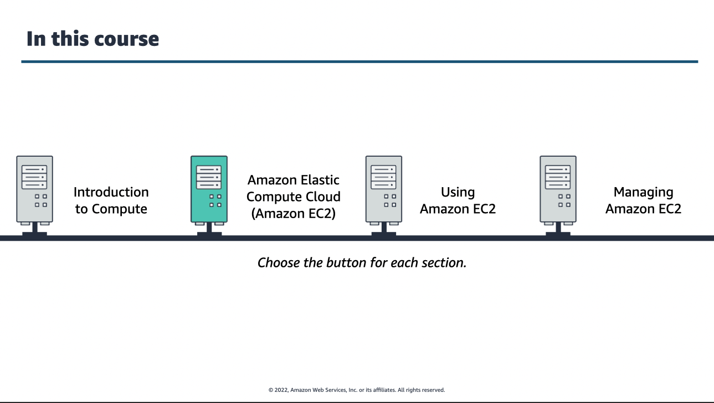

The lesson should be covered in about 10 minutes (max 15 minutes).
For the class recommend, stopping at the Amazon EC2 usecases slide.

**Copyright Amazon Educate**

The above video, gives us an overview of Amazon EC2, and what it can be
used for.

Now we move to the hands on part of this class, where we will
login to AWS Console, and launch a virtual machine in the Amazon EC2
cloud, connect to it and then shut it down.

## 2. Login to AWS Management Console

Login to the AWS Management Console by signing in with your username and
password, by clicking the orange button on the top right at this page

https://aws.amazon.com

Once you logon, you will see your AWS Management Console similar to the
image below

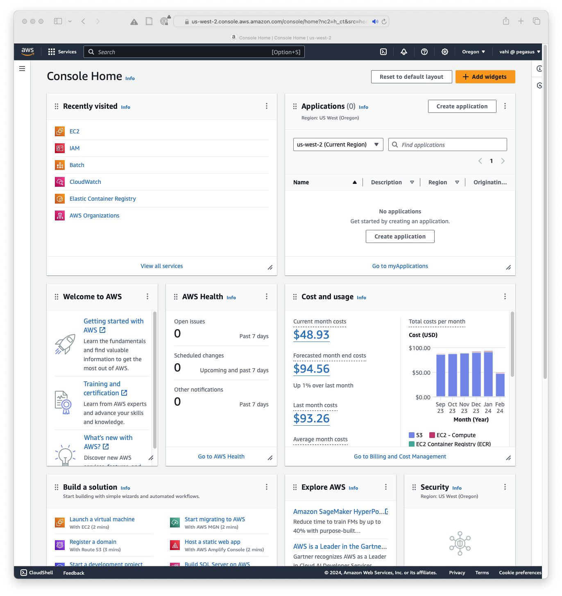

Once logged in, make sure you select Oregon as your AWS region.
To do this, you will see region (orange colored text) next to your
username on the top right of the page. Click on the region and select 
**US West (Oregon) us-west-2**

## 3. Configure and launch a Virtual Machine in EC2 Oregon Region

Next, we will launch the EC2 console. To do this on your AWS 
Console page, look for **Build a Solution**. The first option there is
*Launch a virtual machine With EC2 (2 mins)* . Click on that. This will
bring you to the EC2 dashboard similar to the image below

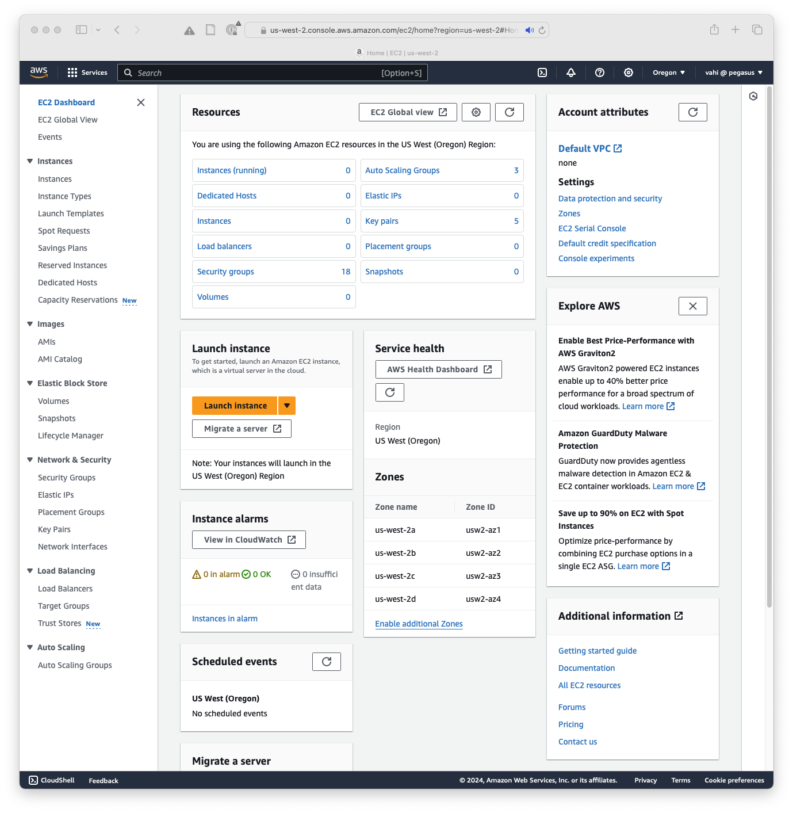

There you would see an orange button in the middle of the page, that says
**Launch Instance**. Click on that. This will take you to the EC2
Launch an Instance Wizard. We will go through the main options for
us to launch the instance.

### Step 1: Name and Tags

Name and tags allows you to give a descriptive name for the Virtual Machine 
instance that you will be launching. In our case, we can name it 
`cicf-week6-instance`. 


### Step 2: Application and OS Images (Amazon Machine Image) 

Next we will select the Amazon Machine Image (AMI) to launch. The AMI
is a virtual machine image contains the software configuration (operating system
(OS), application server, and applications) required to launch your instance.

You will see an option to launch images of different types such as
* Amazon Linux
* Mac OS
* Windows
* Ubuntu etc

We will select Amazon Linux image that is also eligible for free tier.
In our case, we select **Amazon Linux 2023 AMI**.

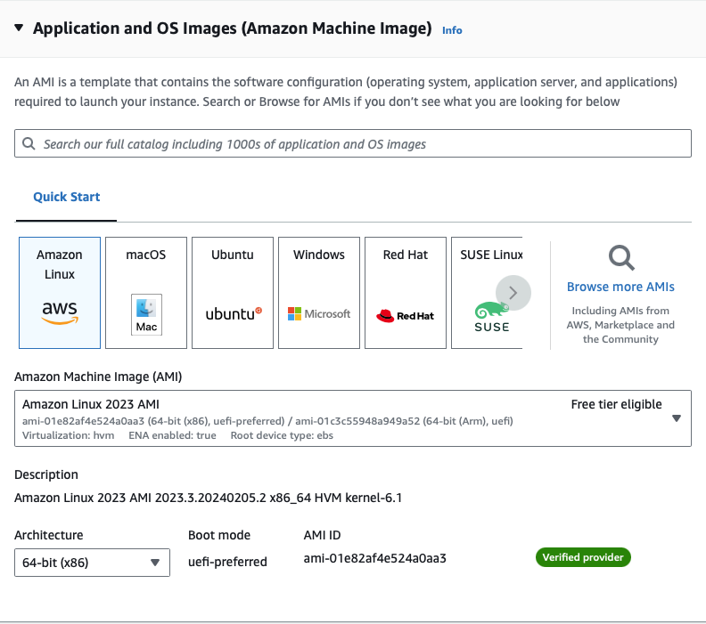

### Step 3: Configure Instance Type

Next we will select the instance type. Instance type dictates what type 
(how many cores, memory, cpu type, storage) of machine comes up. We will
opt for the smallest and free tier eligible one called **t2.micro**.


### Step 4: Key pair(login)

Next we will generate a key pair (ssh keypair) to be able to logon to the 
virtual machine once it starts in EC2. Since this is our first time, 
we will first create a keypair by clicking on **create new keypair**.


This will bring up the create key pair dialog box. We will opt for
the **pem** format, and name our key *username-cicf*.


The downloaded keypair, we will store in $HOME/.ec2 directory. 
In the terminal on your laptop, do the following

```
$ mkdir ~/.ec2
```

Then move the file into ~/.ec2 from your dowloads folder. Depending on your
OS you will run a command similar to below

```
$ mv ~/Downloads/<username>-cicf.pem ~/.ec2
```

Replace <username> with your username and ~/Downloads with path to 
the directory where you pem file was downloaded to.

Going back to the browser, make sure your keypair is selected.
For example 


### Step 5: Configure Network Settings

Next, we will configure the network settings. The network settings essentially
allow you to define the network in which your virtual machine will be launched.
The most pertinent that you need to know of are

**Auto-assign public IP** whether you want a public IP addresses assigned to the
that starts up. In our case, since we want to be able `ssh` into the Virtual
Machine after it starts up, the answer is yes.

**Firewall (security groups)** A security group is a set of firewall rules 
that controls the traffic to and from your instance. Inbound rules control 
the incoming traffic to your instance, and outbound rules control the 
outgoing traffic from your instance. You can assign one or more security 
groups to your instance. In our case, we will create a security group and
click on the option *Allow SSH traffic from* and have it set to **Anywhere**.

The above means, that we can connect to this instance using ssh from
anywhere on the internet. In practise, for real world work this setting
is more locked down (i.e. restricted to a range of IPs)

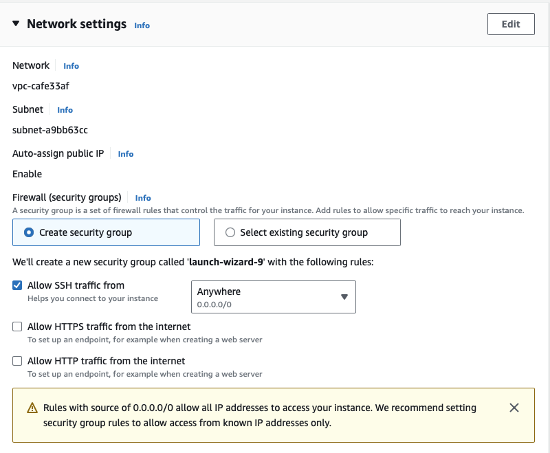

### Step 6: Configure Storage

In the next step, you have an option of associating additonal volumes
(think of them as adding hard disks to your machine) to your virtual
machine instance. In our case we will not add any extra volumes, but
do with the root volume with the instance.

### Advanced Details

We will skip this.

### Step 7: Summary and Launch Instance

The last section on the EC2 launch wizard is the summary page, where
you will see an orange button that asks you to launch the instance.

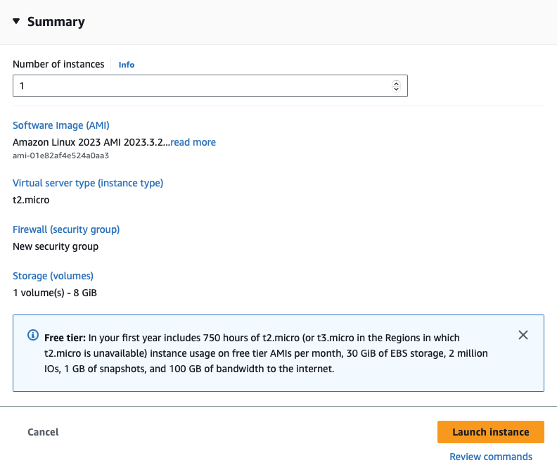

Click on the launch button, and you should see the instance being
launched. In a minute or so, the status bar should turn green, and 
you should see a message like shown below

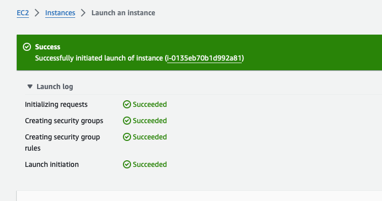

## 4. Connect to the running Virtual Machine via SSH

Now, we will try and connect to the launched instance using the
ssh keypair we generated in the previous section. 

In order to navigate to launched instance, you can click on
the Instances menu in the left menu bar of the EC2 dashboard. After
clicking on this, you should see all of your instances. In our case
it is only one instance, and it should indicate that it 
is in running state. If you just launched the instance, you will 
see messages such as starting up etc, in the instances state.

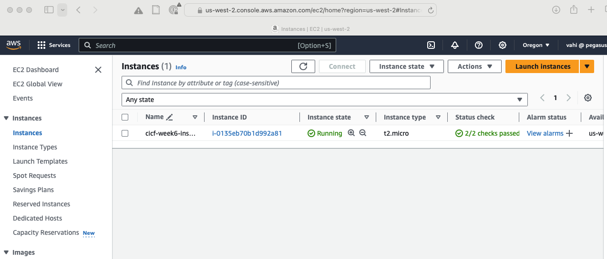

Click on the instance id (starts with i- prefix) of the instance you want 
to connect to. Clicking on this, will get you to the details of the 
instance you just launched 

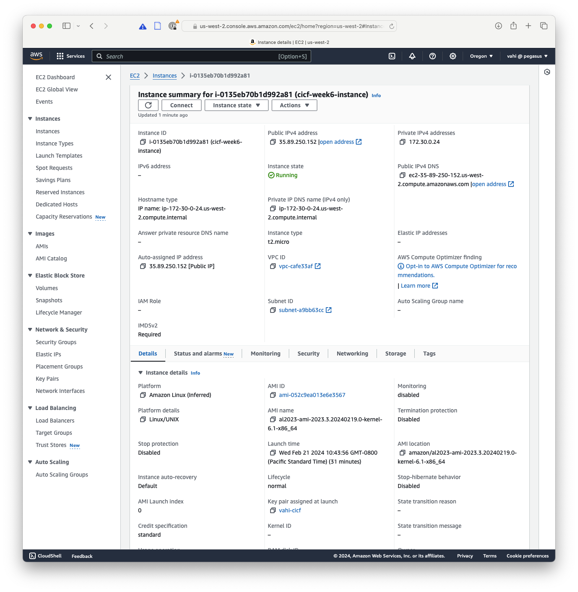

On the instance details page, you will see a lot of details.
Two of them are of particular interest to us 

* Public IPv4 DNS: This is the IP address of your instance that you can connect to from your laptop
* Key pair assigned at launch: This is the SSH key we have to use to connect

To copy the the ip address you click the 2 small overlapping squares

Now to connect to the instance you open the terminal on your laptop,
and run the following command

ssh -i ~/.ec2/<username>-cicf.pem ec2user@<public IPv4 address>

An example invocation is below 

```
$  ssh -i ~/.ec2/vahi-cicf.pem ec2-user@ec2-35-89-250-152.us-west-2.compute.amazonaws.com
   ,     #_
   ~\_  ####_        Amazon Linux 2023
  ~~  \_#####\
  ~~     \###|
  ~~       \#/ ___   https://aws.amazon.com/linux/amazon-linux-2023
   ~~       V~' '->
    ~~~         /
      ~~._.   _/
         _/ _/
       _/m/'

```

## 5. Terminate your running instance

Remember, that we are running in the Cloud. And you are charged for everthing.
Even though in this exercise, we launched a VM from the free tier; your account
only has a small set free tier hours assigned. 

Go back to your instance details page of your instance on the dashboard.
Click on the instance state drop down menu on the top, and change the
instance to terminate the instance

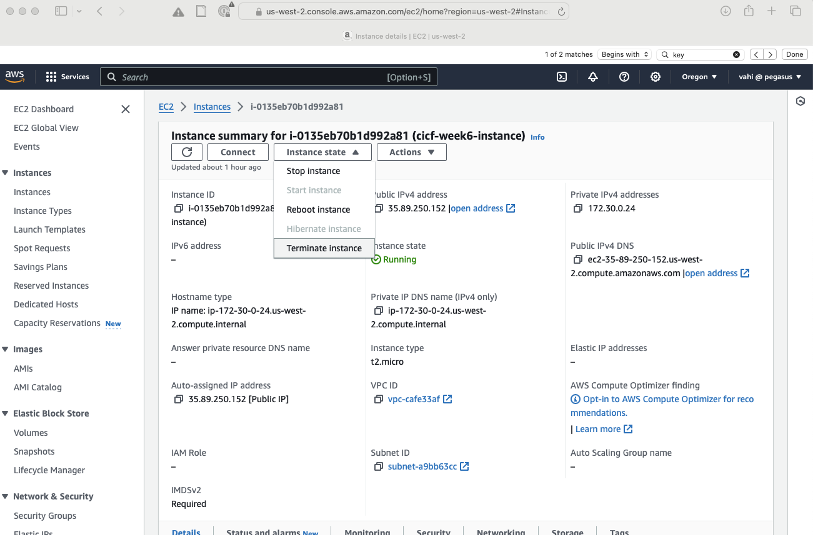

On changing the state to terminate, you will get a pop up warning box, asking 
for confirmation. Click on the orange terminate button


On terminating the instance, the instance gets shutdown and your instance
IP address etc gets deallocated. Also, more importantly you will no longer be 
charged for instance usage. Any data that was stored locally on the instance
will be lost.

You should now see a green banner on the instance details page saying 
successfully terminated. 

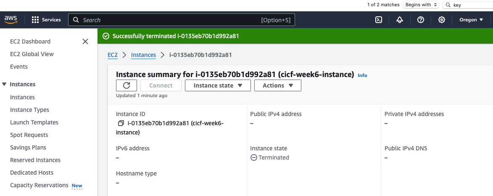

### Terminate vs Shutdown/STOP

Alternatively we could have changed the state to shutdown of the instance.
The difference between terminating and shutdown is that the associated EBS
volume would have been decoupled but not deleted. The volume will continue to 
persist in its availability zone. Standard charges for EBS volumes will apply. 
Therefore, you should only stop an instance if you plan to restart it again
within a reasonable timeframe. Otherwise, you might want to terminate an instance
instead of stopping it for cost saving purposes.

## Resources

1. AWS Educate https://aws.amazon.com/education/awseducate/
2. Tutorial: Get started with Amazon EC2 Linux instances https://docs.aws.amazon.com/AWSEC2/latest/UserGuide/EC2_GetStarted.html 


