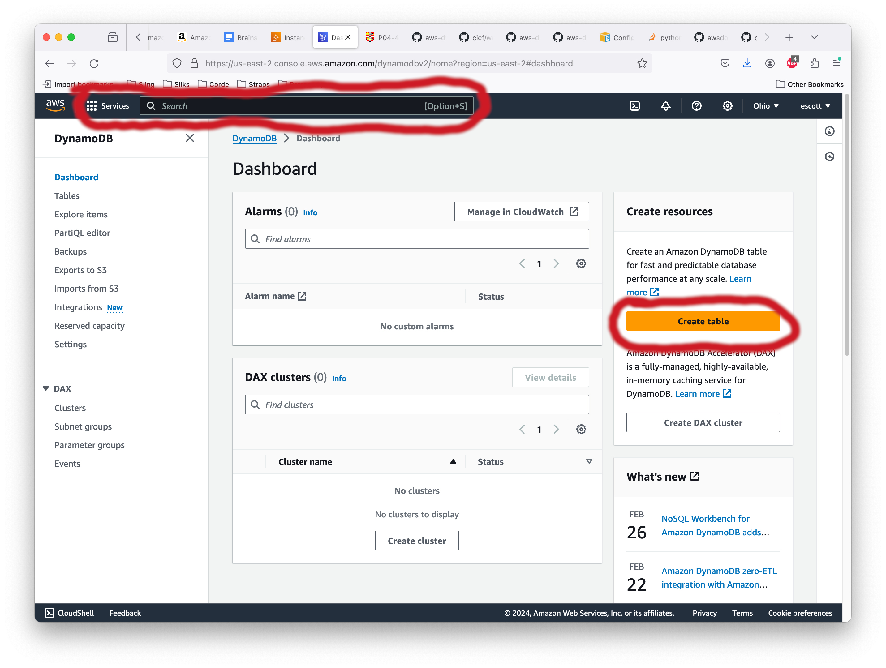
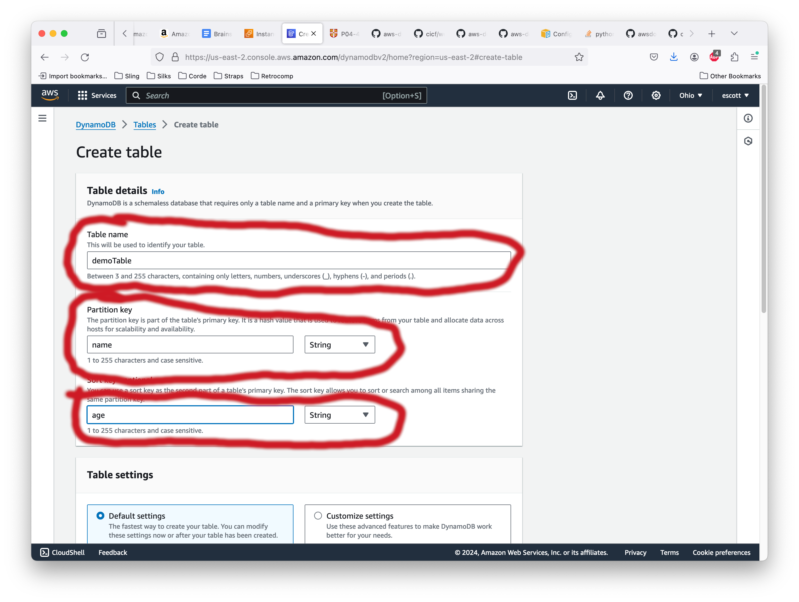
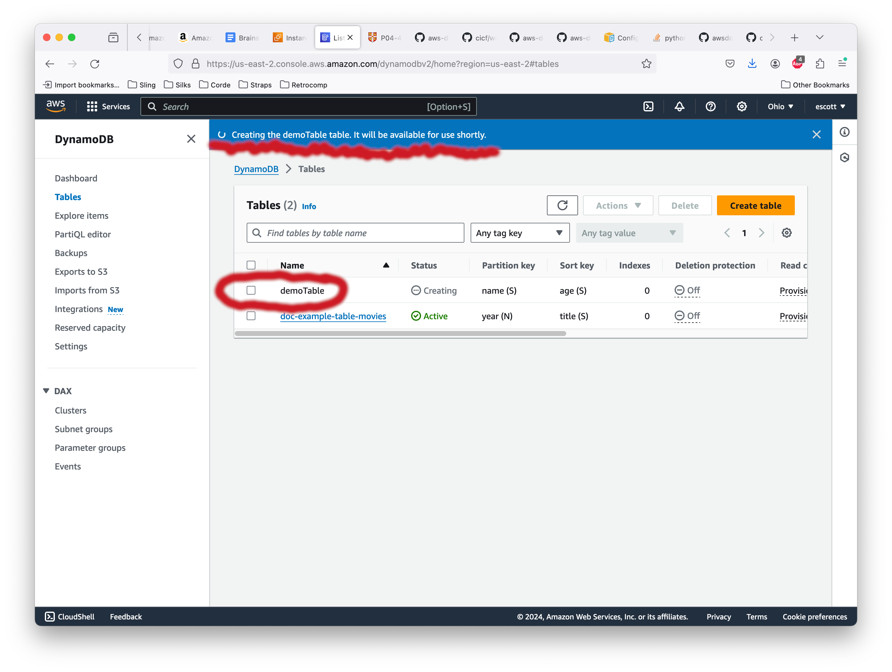

# Configuring Amazon's DynamoDB

You may choose to do this during the lab exercise today, or you might
just choose to watch me do it and use the instance I've created. I
recommend the latter because there are umpteen dozen steps to go
through and each one of them has to be right, but it's your call. If
you're working on this later and you get stuck, send me some email and
we'll get it sorted out.

With that said, let's get started. There are two basic steps to
accomplish: get Dynamo running andv go through the security
configuration so it can be used from programs and not just the
web-based management console.

## The actual DynamoDB config *per se*

The very first step is to go to the DynamoDB console page. From
anywhere in AWS's maze of console pages, you can enter a product to
search for or you can click on "Services" to pop up a dialog of
service consoles you've used lately.

Once you've searched for the DynamoDB product and gone to that page,
click on "Create Table" to get started.

You'll be prompted to enter the name for the table and you'll get to
specify the first of your columns. The "Partition key" field is
mandatory. This field is the one that is used, if need be, to split
your data among many, many servers. The other field is for a "sort
key". Partition key values don't have to be unique, but the
combination of a Partition key and a Sort key do have to be unique
across the entire table.

In our case, we've decided that name and age, together, have to be
unique for out little throwaway example.

Scroll down to the bottom of that page and hit the "Create Table"
button.

Clicking the "Create Table" button puts in a request to create the
table. The proces is usually very fast, taking just a handful of
seconds at the outside. You will be immediately taken to the "Tables"
view of the console, highlighted in blue on the left edge of the
browser. In the screenshot below, notice that "demoTable" is shown in
black and isn't a clickable, underlined blue thing yet. In a few
moments it will be. When it is, go ahead and click on it.

We should put some data in our new table, don't you think? Since we
clicked on "demoTable" a moment ago, we now have a view of that table
up. Click on the "Actions" button and select "Create Item".

